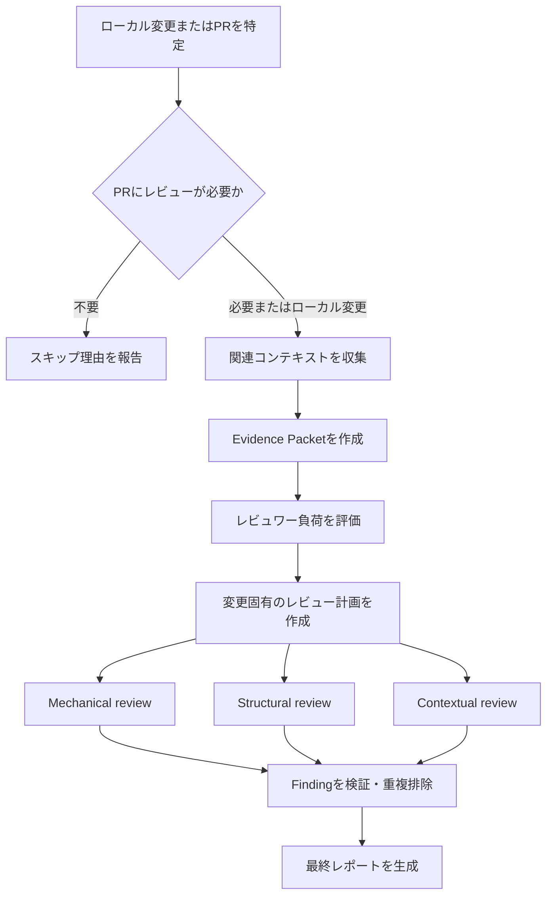

# Review Plugin

[English](README.md) | 日本語 | [简体中文](README.zh-CN.md)

専門エージェント、リポジトリのチェック、証拠に基づくFinding検証を使用して、ローカル変更とGitHub Pull Requestを自動レビューします。

## 概要

Review Pluginは、関連コンテキストの収集、変更がレビュー対象として適切かの判定、変更固有のレビュー計画の作成、mechanical・structural・contextualの観点からの実装確認を行います。最後に独立した検証処理が、推測的または重複したFindingを除外してレポートを生成します。

次の2つのモードに対応します。

- **Developer mode**: 現在のリポジトリにあるコミットと作業ツリーの変更をレビューします。
- **Reviewer mode**: 番号またはURLで指定されたGitHub Pull Requestをレビューします。

一般的な多段階レビューの考え方を参考にしたクリーンルーム実装です。コンテキスト収集、計画、レビュー、Finding検証、レポート生成はすべてこのプラグイン内で完結します。

## コマンド

### `/review:review`

ローカル変更またはGitHub Pull Requestを、証拠に基づいてレビューします。

処理内容：

1. ローカル変更または指定されたPull Requestを特定します。
2. Reviewer modeではレビュー要否を判定し、closed、draft、trivial、already-reviewedのPRをスキップします。
3. レビュー対象に明示的に関連するコンテキストだけを収集します。
4. 変更がレビュワーに過大な負荷を与えないかを評価します。
5. 変更内容と`REVIEW.md`からレビュー計画を作成します。
6. 3つの専門レビュー層を並列実行します。
   - テスト、静的解析、客観的シグナルを確認するMechanical review
   - 設計、実行経路、状態、セキュリティ、性能、保守性を確認するStructural review
   - 要求、意図、互換性、ドキュメントを確認するContextual review
7. コードと利用可能な証拠に照らしてFinding候補を再検証します。
8. 検証済みFinding、人間による判断が必要な項目、明示的な制約だけを報告します。

使用方法：

```text
/review:review
/review:review <PR番号>
```

自然言語での依頼にも対応します。

```text
ローカル変更をレビューして
PR 123をレビューして
このPRをレビューして: https://github.com/owner/repository/pull/123
```

Pull Request URLは自然言語の依頼では指定できますが、`/review:review`の直接引数には指定できません。

機能：

- Developer modeとReviewer mode
- Pull Requestのレビュー要否検証
- ISO/IEC 25010の品質特性に基づく変更固有の計画
- Mechanical・Structural・Contextual reviewの並列実行
- 明示的に参照された情報源からの読み取り専用コンテキスト収集
- 生文書の代わりに簡潔なEvidence Packetを使用
- Findingの独立検証と重複排除
- レビュー範囲、証拠、制約の明示

レビューレポート形式：

```text
## Review Summary

Potential problems: 1
Human decisions: 1
Verified concerns: 6
Could not verify: 1

## Change Scope

Focused — one self-contained change

## Needs Your Attention

1. Potential problem: retry can duplicate the write operation
   Evidence: src/example.ts:42
   Confirm: whether the external operation is idempotent

## Review Coverage

| Subcharacteristic | Concern | Result | Evidence |
|---|---|---|---|
| Recoverability | Recovery and consistency | Retry path inspected | src/example.ts:35 |
```

結果の分類：

- **Potential problem**: 変更コード、現実的な発生条件、観測可能な影響から不具合の可能性が示されるもの。
- **Human decision**: コード上の事実は確認できるものの、プロダクト・設計・ビジネス上の判断が必要なもの。
- **Verified by AI**: 該当範囲を確認し、その観点では問題が見つからなかったもの。
- **Could not verify**: 必要な仕様、測定値、権限、実行証拠が得られないもの。

除外するFalse Positive：

- 変更による実質的な影響がない既存問題
- 現実的な実行経路がない仮説上の問題
- CIですでに検出されるformat、lint、単純な型エラー
- 個人的なスタイルの好みや曖昧な一般論
- 重複または根拠のないFinding

## インストール

開発中にプラグインを直接読み込みます。

```bash
claude --plugin-dir /path/to/review
```

使用前に検証します。

```bash
claude plugin validate /path/to/review --strict
```

## ベストプラクティス

### `/review:review`の使い方

- Pull Requestの説明では、意図、振る舞い、制約を明確にします。
- 関連Issue、仕様、決定事項を明示的にリンクします。
- cleanで有効なGitリポジトリからレビューを実行します。
- Findingは自動的な承認・却下ではなく、人間の判断材料として扱います。
- リポジトリのテスト・静的解析コマンドをCIと一致させます。

### 使用に適する場面

- Pull Request作成前のローカル変更
- 振る舞いやアーキテクチャに意味のある変更を含むPull Request
- 重要な実行経路、永続化、認証、外部サービスに関わる変更
- リンクされた情報源に対して要求や互換性を確認する必要がある変更
- 振る舞いとコードベースへの影響を独立検証する必要があるリファクタリング

### 使用に適さない場面

- レビュー対象のコミットや作業ツリー変更がない場合
- 自動化で担保済みのformat変更または生成ファイルだけの場合
- 不足しているプロダクト要件や人間の判断の代替として使う場合
- 利用可能な読み取り専用ツールで対象へアクセスできない場合

## ワークフローへの組み込み

### 標準的なローカルレビュー

```text
# ローカルリポジトリで変更する
/review:review

# Needs Your AttentionとReview Coverageを確認する
# 確認した問題を修正し、レビューを再実行する
```

### 標準的なPull Requestレビュー

```text
# PR番号でレビューする
/review:review 123

# または自然言語でURLを指定する
このPRをレビューして: https://github.com/owner/repository/pull/123

# Findingを確認し、人間が最終判断する
```

レビューはデフォルトで読み取り専用です。別途明示的に依頼されない限り、ソースファイルの変更、依存関係のインストール、リポジトリ設定の変更、GitHubコメントの投稿は行いません。

## 要件

- プラグインとエージェントに対応したClaude Code
- Developer modeで使用するGitリポジトリ
- Reviewer modeで使用する、インストールおよび認証済みのGitHub CLI（`gh`）
- 対象リポジトリとPull Requestへのアクセス権
- Mechanical verificationに使用するリポジトリ定義済みのテスト・解析コマンド
- 外部証拠が必要な場合に使用できる読み取り専用ツール

## トラブルシューティング

### 変更が見つからない

問題：Developer modeがレビュー対象なしと報告する。

解決方法：

- 現在のブランチにupstreamより先行するコミットがあるか確認します。
- staged、unstaged、または関連するuntrackedソースファイルを確認します。
- 対象のGitリポジトリからコマンドを実行します。

### Pull Requestを特定できない

問題：Reviewer modeが指定されたPull Requestを取得できない。

解決方法：

- `gh auth status`が成功することを確認します。
- リポジトリに正しいGitHub remoteが設定されていることを確認します。
- PR番号またはURLが現在のリポジトリに属することを確認します。
- 曖昧さのないPull Request対象を1つだけ指定します。

### レビューが未完了と表示される

問題：1つ以上のチェックを完了できない。

解決方法：

- `Could not verify`の項目で、不足する前提条件や証拠を確認します。
- 参照された仕様を互換性のある読み取り専用情報源から取得可能にします。
- 既存のリポジトリチェックに必要な依存関係を復元します。
- 信頼できないPull Requestのコード実行が必要な場合は、別途実行を承認します。

### テストまたは静的解析が実行されない

問題：Mechanical verificationでコマンドがblockedまたはunavailableと記録される。

解決方法：

- リポジトリのtest、lint、type-check、buildコマンドを文書化します。
- 必要な依存関係がインストール済みであることを確認します。レビュー処理は依存関係をインストールしません。
- コマンドを現在の環境で安全に実行できることを確認します。

### Findingが多すぎる、または少なすぎる

問題：レビューの焦点がリポジトリの要件と合っていない。

解決方法：

- `REVIEW.md`を具体的な適用条件と検証基準で更新します。
- 対象コードの近くに明示的なリポジトリガイダンスを追加します。
- Pull Requestの説明を改善し、権威ある要求文書をリンクします。

## ヒント

- 焦点を絞ったPull Requestにします。凝集した変更ほど信頼性の高い検証が容易です。
- 何を変更したかだけでなく、なぜ変更するかを説明します。
- 要求を直接リンクし、関連箇所だけを取得できるようにします。
- 再現可能なCIコマンドをリポジトリに残します。
- 証拠不足を推測で補わず、`Could not verify`を確認します。
- Review Coverageで確認済み項目と制約を把握します。

## 設定

### レビュー基準のカスタマイズ

品質上の関心、適用条件、検証方法、結果分類、最終レポートの方針を変更するには`REVIEW.md`を編集します。

デフォルトのカバレッジモデルでは、次のISO/IEC 25010品質特性を検討します。

- 機能適合性
- 信頼性
- 性能効率性
- 使用性
- セキュリティ
- 互換性
- 保守性
- 移植性

現在の変更に適用できる基準だけを選択します。

### エージェントのカスタマイズ

エージェントの責務と出力契約は`agents/`以下で定義します。

- `agents/context/context.md` — コンテキスト収集とEvidence Packetの作成
- `agents/validation/review-needed.md` — Pull Requestのレビュー要否
- `agents/validation/small-cls.md` — Change Scopeとレビュワー負荷
- `agents/review/mechanical.md` — 客観的なリポジトリチェック
- `agents/review/structural.md` — コードとアーキテクチャの分析
- `agents/review/contextual.md` — 意図と要求の分析
- `agents/comment/comment.md` — Findingの検証と重複排除

オーケストレーションと最終レポートの規則は`skills/review/SKILL.md`に保持します。

## 技術詳細

### ディレクトリ構成

```text
review/
├── .claude-plugin/
│   └── plugin.json
├── agents/
│   ├── context/
│   │   └── context.md
│   ├── validation/
│   │   ├── review-needed.md
│   │   └── small-cls.md
│   ├── review/
│   │   ├── mechanical.md
│   │   ├── structural.md
│   │   └── contextual.md
│   ├── comment/
│   │   └── comment.md
│   └── README.md
├── skills/
│   └── review/
│       └── SKILL.md
├── docs/
│   ├── ja/
│   └── zh-CN/
├── REVIEW.md
├── README.md
├── README.ja.md
├── README.zh-CN.md
└── LICENSE
```

### エージェント構成

- 1つのeligibility agentがPull Requestにレビューが必要かを判定します。
- 1つのcontext agentが明示的に参照された証拠を収集します。
- 1つのscope agentが凝集性とレビュワー負荷を分類します。
- review skillが対象固有のレビュー計画を作成します。
- 3つの専門エージェントがMechanical・Structural・Contextualの観点を並列レビューします。
- 1つのcomment agentがFinding候補を検証し、検証済み結果を生成します。
- review skillがFindingを追加・再評価せずに最終レポートを整形します。

### レビューワークフロー



### コンテキストの扱い

context agentはレビュー対象に関連付けられた参照だけをたどります。後続処理にはNotion、Confluence、Google Docs、GitHub、Web、リポジトリ内文書の生データではなく、簡潔なEvidence Packetを渡します。取得できない情報や情報源の矛盾は、Packetと最終カバレッジに明示します。

### GitHub連携

Reviewer modeでは`gh`を使用して次を行います。

- Pull Requestのメタデータ、branch、SHAの特定
- 変更ファイル、diff、関連Issue、checkの読み取り
- 作業ツリーを変更しないリポジトリ情報へのアクセス

checkoutが必要な場合は、特定したhead SHAから隔離された一時worktreeを作成し、証拠収集後に削除します。

## Author

takuto-san

## Version

0.1.0

[MIT License](LICENSE)の下で提供されます。
