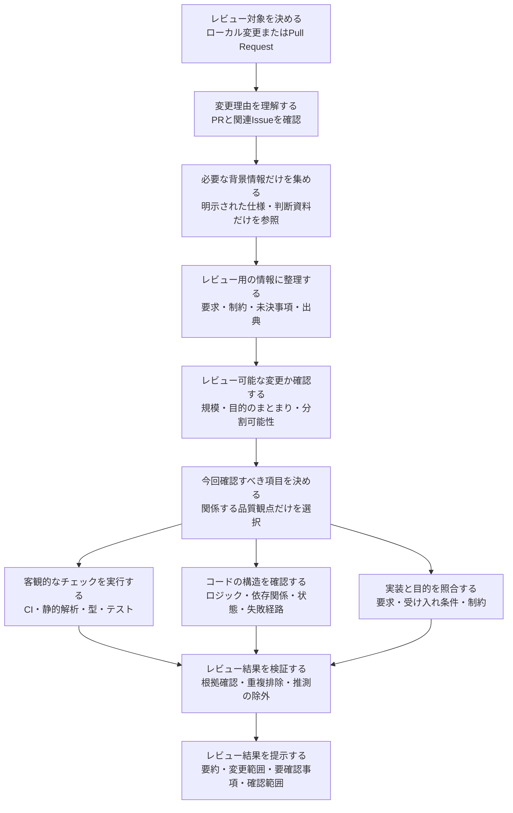

# review

[English](README.md) | 日本語 | [简体中文](README.zh-CN.md)

ローカル変更およびGitHub Pull RequestをレビューするためのClaude Codeプラグインです。

一般的な多段階レビューの考え方を参考にしたクリーンルーム実装です。コンテキスト収集、レビュー計画、専門化されたレビュー層、Findingの検証、最終レポート生成は、このプラグイン内で完結します。

## ドキュメント

- [日本語ドキュメント](docs/ja/README.md)
- [実行時の英語版レビュー基準](REVIEW.md)
- [简体中文文档](docs/zh-CN/README.md)

## 処理フロー



`context`エージェントは、利用者の環境で使用可能な任意の読み取り専用情報源を利用できます。レビュー対象から明示的に参照された情報だけをたどり、生の文書ではなく、必要な情報を整理したEvidence Packetをレビュー層へ渡します。

## 構成

```text
review/
├── .claude-plugin/
│   └── plugin.json
├── agents/
│   ├── context/
│   │   └── context.md
│   ├── validation/
│   │   └── small-cls.md
│   ├── review/
│   │   ├── mechanical-reviewer.md
│   │   ├── structural-reviewer.md
│   │   └── contextual-reviewer.md
│   ├── comment/
│   │   └── comment.md
├── commands/
│   └── review.md
├── REVIEW.md
├── docs/
│   ├── ja/
│   └── zh-CN/
├── README.md
├── README.ja.md
├── README.zh-CN.md
└── LICENSE
```

## 使用方法

```text
/review:review
/review:review 123
/review:review https://github.com/owner/repository/pull/123
```

最初のコマンドは、現在のブランチと作業ツリーにあるローカル変更をレビューします。PR番号またはURLを指定するとレビュワーモードになります。

レビュー開始前に、`context`エージェントがレビュー対象から明示的に参照された情報だけを取得し、媒体に依存しない簡潔なEvidence Packetへ変換します。Notion、Confluence、Google Docs、GitHub、Web、リポジトリ内文書などの生データを、そのままレビューエージェントへ渡すことはありません。

## 開発

```bash
claude plugin validate . --strict
claude --plugin-dir .
```

MIT Licenseで提供されます。
