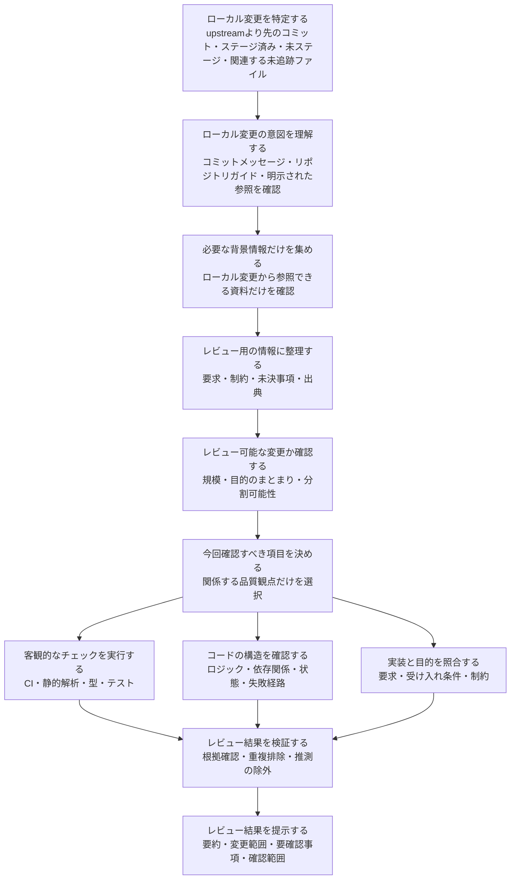
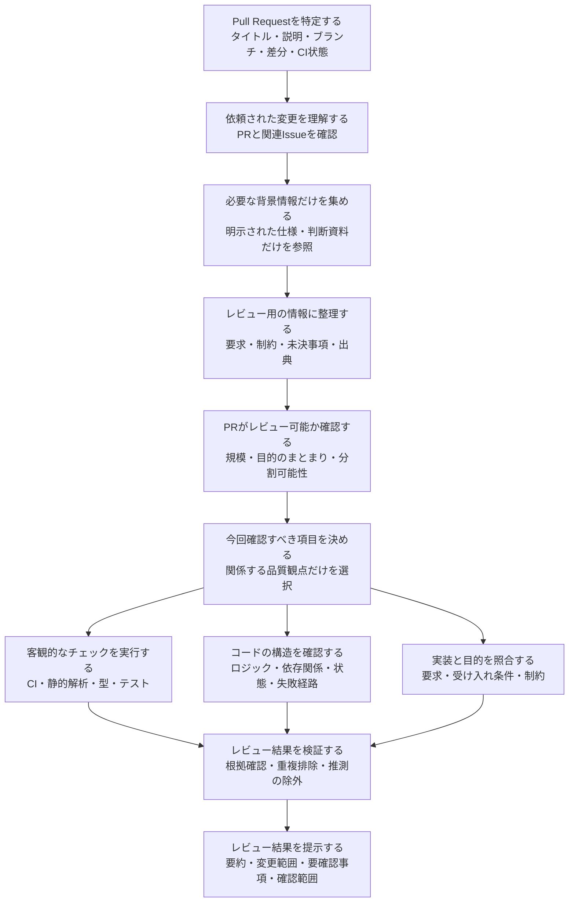

# review

[English](README.md) | 日本語 | [简体中文](README.zh-CN.md)

ローカル変更およびGitHub Pull RequestをレビューするためのClaude Codeプラグインです。

一般的な多段階レビューの考え方を参考にしたクリーンルーム実装です。コンテキスト収集、レビュー計画、専門化されたレビュー層、Findingの検証、最終レポート生成は、このプラグイン内で完結します。

## ドキュメント

- [日本語ドキュメント](docs/ja/README.md)
- [英語ドキュメント](README.md)
- [简体中文文档](docs/zh-CN/README.md)

Claude Codeのエージェントは、`skills/`、`agents/`、およびルートの`REVIEW.md`にある英語ファイルを読み込みます。`docs/ja/`と`docs/zh-CN/`は人間向けの翻訳であり、レビューエージェントには読み込まれません。

## 処理フロー

### Developer mode

現在のローカルリポジトリにあるコミットと作業ツリーの変更をレビューします。



### Reviewer mode

PR番号またはURLで指定されたGitHub Pull Requestをレビューします。



`context`エージェントは、利用者の環境で使用可能な任意の読み取り専用情報源を利用できます。レビュー対象から明示的に参照された情報だけをたどり、生の文書ではなく、必要な情報を整理したEvidence Packetをレビュー層へ渡します。

## 構成

```text
review/
├── .claude-plugin/
│   └── plugin.json
├── agents/
│   ├── context/
│   │   └── context.md
│   ├── validation/
│   │   └── small-cls.md
│   ├── review/
│   │   ├── mechanical.md
│   │   ├── structural.md
│   │   └── contextual.md
│   ├── comment/
│   │   └── comment.md
├── skills/
│   └── review/
│       └── SKILL.md
├── REVIEW.md
├── docs/
│   ├── ja/
│   └── zh-CN/
├── README.md
├── README.ja.md
├── README.zh-CN.md
└── LICENSE
```

## 使用方法

```text
/review:review
/review:review 123
/review:review https://github.com/owner/repository/pull/123
ローカル変更をレビューして
このPRをレビューして https://github.com/owner/repository/pull/123
```

`/review:review`による明示実行だけでなく、自然言語のレビュー依頼からもSkillが自動選択されます。依頼のどこかにPR番号またはURLがあればReviewer mode、PRを指定せず現在またはローカル変更のレビューを依頼した場合はDeveloper modeになります。

レビュー開始前に、`context`エージェントがレビュー対象から明示的に参照された情報だけを取得し、媒体に依存しない簡潔なEvidence Packetへ変換します。Notion、Confluence、Google Docs、GitHub、Web、リポジトリ内文書などの生データを、そのままレビューエージェントへ渡すことはありません。

## 開発

```bash
claude plugin validate . --strict
claude --plugin-dir .
```

MIT Licenseで提供されます。
