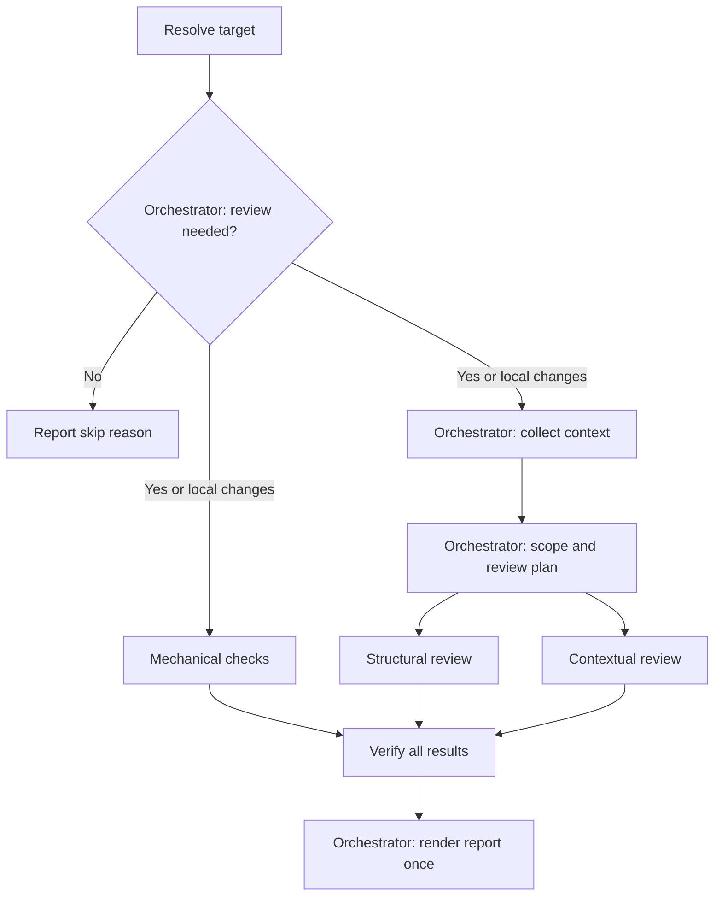

# Review PR Plugin

<!-- English | [日本語](docs/README.ja.md) | [简体中文](docs/README.zh-CN.md) -->

Automated review for local changes and GitHub pull requests using specialized agents, repository checks, and evidence-based finding verification.

## Table of Contents

- [1. Overview](#1-overview)
- [2. Architecture](#2-architecture)
  - [Directory Structure](#directory-structure)
  - [Review Workflow](#review-workflow)
- [3. Usage](#3-usage)
- [4. Installation](#4-installation)
- [5. Usage Guide](#5-usage-guide)
- [6. Configuration](#6-configuration)
- [7. Technical Details](#7-technical-details)
- [8. Project Information](#8-project-information)

## 1. Overview

The Review Plugin gathers relevant context, evaluates whether a change is reviewable, builds a change-specific plan, and audits the implementation from mechanical, structural, and contextual perspectives. A separate verification stage removes speculative or duplicate findings before producing the final report.

It supports two modes:

- **Developer mode** reviews commits and working-tree changes in the current repository.
- **Reviewer mode** reviews a GitHub pull request identified by its number or URL.

This is a clean-room implementation inspired by multi-stage review workflows. Context collection, planning, review, finding verification, and report generation are implemented entirely by this plugin.

## 2. Architecture

### Directory Structure

```text
review/
├── .claude-plugin/
│   └── plugin.json
├── agents/
│   ├── review/
│   │   ├── mechanical.md
│   │   ├── structural.md
│   │   └── contextual.md
│   ├── verify/
│   │   └── verify.md
│   └── README.md
├── skills/
│   └── review-pr/
│       ├── SKILL.md
│       └── checks/
│           ├── eligibility.md
│           └── scope.md
├── REVIEW.md
├── README.md
└── LICENSE
```

### Review Workflow



## 3. Usage

### Command: `/review-pr`

Performs an evidence-based review of local changes or a GitHub pull request.

What it does:

1. Resolves local changes or the requested pull request.
2. In Reviewer mode, checks whether review is needed and skips closed, draft, trivial, or already-reviewed pull requests.
3. Collects only context explicitly connected to the review target.
4. Evaluates whether the change creates excessive reviewer workload.
5. Builds a review plan from the change and `REVIEW.md`.
6. Runs three specialized review layers in parallel:
   - Mechanical checks for tests, static analysis, and objective signals
   - Structural review for design, execution paths, state, security, performance, and maintainability
   - Contextual review for requirements, intent, compatibility, and documentation
7. Revalidates candidate findings against the code and available evidence.
8. Reports only verified findings, human decisions, and explicit limitations.

Usage:

```text
/review-pr
/review-pr <PR number>
```

Natural-language requests are also supported:

```text
Review my local changes
Review PR 123
Review this PR: https://github.com/owner/repository/pull/123
```

A pull request URL is supported in a natural-language request, but not as a direct `/review-pr` argument.

### Features

- Developer and Reviewer modes
- Review-need validation for pull requests
- Change-specific planning based on ISO/IEC 25010 quality characteristics
- Parallel mechanical, structural, and contextual review
- Read-only context collection from explicitly referenced sources
- Compact review context instead of raw source documents
- Independent verification and deduplication of findings
- Explicit review coverage, evidence, and limitations

### Review Report Format

```text
| Review Layer | Review Item | Label | Result / Evidence |
|---|---|---|---|
| Mechanical | Unit tests | LGTM | Existing unit tests passed. |
| Structural | 001: Recovery | Please Fix | src/example.ts:42: a retry repeats a completed write without an idempotency guard. |
| Contextual | 002: Date format | Unable to Verify | The supplied specifications conflict; authoritative precedence is missing. |

| Label | Count |
|---|---|
| Please Fix | 1 |
| Need Review | 0 |
| Unable to Verify | 1 |
| Nit | 0 |
| LGTM | 1 |

Overall: Please Fix

Advisory triage candidates for human review; not automatic merge gates or author requests.
```

#### False Positives Filtered

- Pre-existing issues not materially affected by the change
- Hypothetical problems without a realistic execution path
- Formatting, lint, or simple type errors already covered by CI
- Personal style preferences and vague general advice
- Duplicate or unsupported findings

## 4. Installation

### Prerequisites

The following environment and access are required to run the review:

- Claude Code with plugin and agent support
- A Git repository for Developer mode
- GitHub CLI (`gh`) installed and authenticated for Reviewer mode
- Access to the target repository and pull request
- Repository-defined test or analysis commands for mechanical verification
- Compatible read-only tools when external evidence is required

Load the plugin directly during development:

```bash
claude --plugin-dir /path/to/review
```

Validate it before use:

```bash
claude plugin validate /path/to/review --strict
```

## 5. Usage Guide

### Best Practices for `/review-pr`

- Keep pull request descriptions focused on intent, behavior, and constraints.
- Link relevant issues, specifications, and decisions explicitly.
- Run the review from a clean, valid Git repository.
- Treat findings as evidence for a human decision, not as automatic approval or rejection.
- Keep repository-defined tests and static-analysis commands aligned with CI.

#### When to Use

- Local changes before opening a pull request
- Pull requests with meaningful behavior or architecture changes
- Changes touching critical code paths, persistence, authentication, or external services
- Changes whose requirements or compatibility must be checked against linked sources
- Refactors whose behavior and codebase impact need independent verification

#### When Not to Use

- When there are no commits or working-tree changes to review
- For formatting-only or generated-file changes already enforced by automation
- As a substitute for missing product requirements or human judgment
- When the target cannot be accessed with the available read-only tools

### Workflow Integration

#### Standard Local Review Workflow

```text
# Make changes in a local repository
/review-pr

# Inspect the consolidated results, label counts, and limitations
# Fix confirmed problems and rerun the review
```

#### Standard Pull Request Review Workflow

```text
# Review by pull request number
/review-pr 123

# Or review by URL through natural language
Review this PR: https://github.com/owner/repository/pull/123

# Confirm findings and make the final human review decision
```

The review is read-only by default. It does not modify source files, install dependencies, change repository configuration, or post GitHub comments unless the user explicitly requests a separate action.

## 6. Configuration

### Customizing review criteria

Edit `REVIEW.md` to change quality concerns, applicability conditions, verification guidance, result classifications, or final-report policy.

The default coverage model considers these ISO/IEC 25010 quality characteristics:

- Functional suitability
- Reliability
- Performance efficiency
- Usability
- Security
- Compatibility
- Maintainability
- Portability

Only criteria applicable to the current change are selected.

### Customizing agents

Agent responsibilities and output contracts are defined under `agents/`:

- `skills/review/checks/eligibility.md` — pull request review eligibility
- `skills/review/checks/scope.md` — change scope and reviewer workload
- `agents/review/mechanical.md` — objective repository checks
- `agents/review/structural.md` — code and architecture analysis
- `agents/review/contextual.md` — intent and requirement analysis
- `agents/verify/verify.md` — finding verification and deduplication

Keep orchestration and final-report rules in `skills/review/SKILL.md`.

Give every review-plan item a stable `id` such as `001` and preserve it through layer review and finding verification. Pass required inputs explicitly to each agent, and represent missing evidence as `assessment.evaluation.level: not_assessable` instead of silently omitting an assigned item.


## 7. Technical Details

### Agent architecture

- 1 eligibility agent determines whether a pull request needs review.
- The orchestrator gathers source-backed evidence during preparation.
- 1 scope agent classifies cohesion and reviewer workload.
- The review skill creates a target-specific review plan.
- 3 specialized agents review mechanical, structural, and contextual concerns in parallel.
- 1 verify agent verifies candidates and produces the verified result set.
- The review skill formats the final report without adding or reevaluating findings.

### Context handling

The orchestrator follows only references connected to the review target. Later stages receive compact context rather than raw Notion, Confluence, Google Docs, GitHub, web, or repository documents. Missing and conflicting sources remain explicit in the context and final coverage.

### GitHub integration

Reviewer mode uses `gh` for:

- Resolving pull request metadata, branches, and SHAs
- Reading changed files, diffs, linked issues, and checks
- Accessing repository information without modifying the working tree

If a checkout is required, the workflow uses an isolated temporary worktree and removes it after evidence collection.

## 8. Project Information

### Author

takuto-san

### Version

0.1.0

Licensed under the [MIT License](LICENSE).

## Review evaluation and batching

Structural and contextual work is split into batches of at most five related items per invocation (prefer three to five; smaller batches are valid). The orchestrator assigns unique batch Artifact IDs and consolidates results with exactly one result per assigned item before verification. Three review layers can therefore require more than three agent invocations.

Conformance has four levels plus a separate `not_assessable` state. The verification agent checks evidence and maps evaluations to the five workflow labels defined in `agents/verify/verify.md`. Labels and suggested fixes support human triage; they do not automatically authorize author requests or merge decisions.
