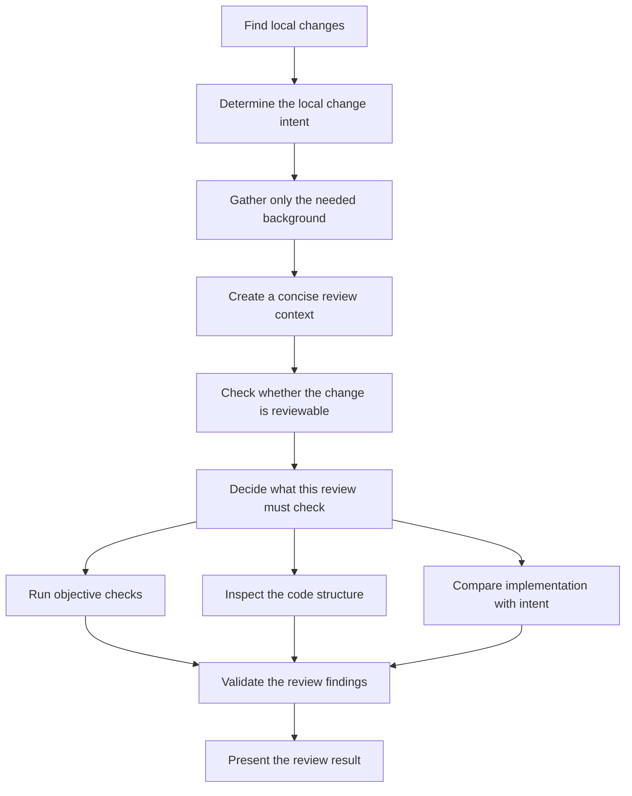
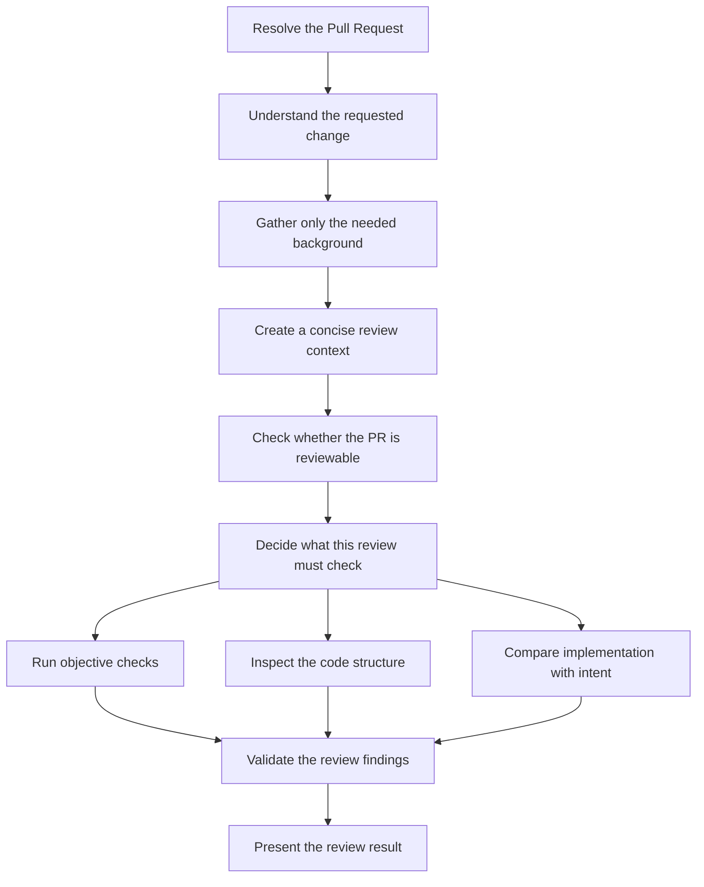

# review

English | [日本語](README.ja.md) | [简体中文](README.zh-CN.md)

A Claude Code plugin for reviewing local changes and GitHub pull requests.

This is a clean-room implementation inspired by multi-stage review workflows.
Its context collection, review planning, specialized review layers, finding
verification, and report generation are implemented entirely by this plugin.

## Documentation

- [日本語ドキュメント](docs/ja/README.md)
- [简体中文文档](docs/zh-CN/README.md)

Claude Code loads the English files in `skills/`, `agents/`, and the root
`REVIEW.md`. Files under `docs/ja/` and `docs/zh-CN/` are human-readable
translations and are not loaded by the review agents.

## Workflow

### Developer mode

Reviews commits and working-tree changes in the current local repository.



### Reviewer mode

Reviews a GitHub Pull Request identified by its number or URL.



The context agent may use any compatible read-only source available in the
user's environment. It follows only references connected to the review target
and passes a compact Evidence Packet—not raw source documents—to the review
layers.

## Structure

```text
review/
├── .claude-plugin/
│   └── plugin.json
├── agents/
│   ├── context/
│   │   └── context.md
│   ├── validation/
│   │   └── small-cls.md
│   ├── review/
│   │   ├── mechanical.md
│   │   ├── structural.md
│   │   └── contextual.md
│   ├── comment/
│   │   └── comment.md
├── skills/
│   └── review/
│       └── SKILL.md
├── REVIEW.md
├── docs/
│   ├── ja/
│   └── zh-CN/
├── README.md
├── README.ja.md
├── README.zh-CN.md
└── LICENSE
```

## Usage

```text
/review:review
/review:review 123
/review:review https://github.com/owner/repository/pull/123
Review my local changes
Review this PR: https://github.com/owner/repository/pull/123
```

The review Skill can be invoked with `/review:review` or selected automatically
from a natural-language review request. A PR number or URL anywhere in the
request selects Reviewer mode; a request to review current or local changes
without a PR target selects Developer mode.

Before review begins, the `context` agent follows only references explicitly
connected to the review target and converts the required information into a
compact, source-independent Evidence Packet. Raw Notion, Confluence, Google
Docs, GitHub, web, or repository content is not passed directly to the review
agents.

## Development

```bash
claude plugin validate . --strict
claude --plugin-dir .
```

Licensed under the MIT License.
