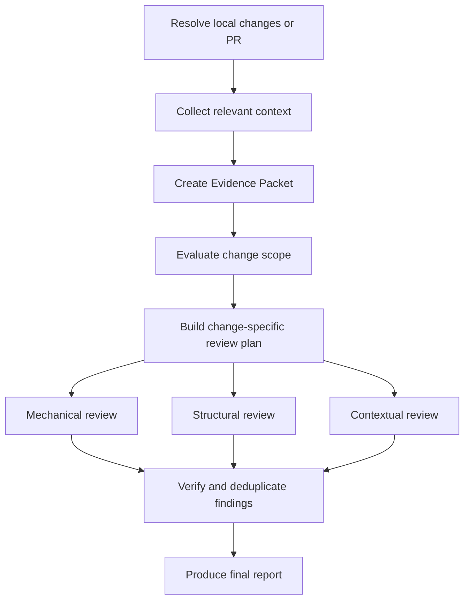

# Review Plugin

Automated review for local changes and GitHub pull requests using specialized agents, repository checks, and evidence-based finding verification.

[日本語](README.ja.md) | [简体中文](README.zh-CN.md)

## Overview

The Review Plugin gathers relevant context, evaluates whether a change is reviewable, builds a change-specific plan, and audits the implementation from mechanical, structural, and contextual perspectives. A separate verification stage removes speculative or duplicate findings before producing the final report.

It supports two modes:

- **Developer mode** reviews commits and working-tree changes in the current repository.
- **Reviewer mode** reviews a GitHub pull request identified by its number or URL.

This is a clean-room implementation inspired by multi-stage review workflows. Context collection, planning, review, finding verification, and report generation are implemented entirely by this plugin.

## Commands

### `/review:review`

Performs an evidence-based review of local changes or a GitHub pull request.

What it does:

1. Resolves local changes or the requested pull request.
2. Collects only context explicitly connected to the review target.
3. Evaluates change size, cohesion, and reviewability.
4. Builds a review plan from the change and `REVIEW.md`.
5. Runs three specialized review layers in parallel:
   - Mechanical checks for tests, static analysis, and objective signals
   - Structural review for design, execution paths, state, security, performance, and maintainability
   - Contextual review for requirements, intent, compatibility, and documentation
6. Revalidates candidate findings against the code and available evidence.
7. Reports only verified findings, human decisions, and explicit limitations.

Usage:

```text
/review:review
/review:review <PR number>
```

Natural-language requests are also supported:

```text
Review my local changes
Review PR 123
Review this PR: https://github.com/owner/repository/pull/123
```

A pull request URL is supported in a natural-language request, but not as a direct `/review:review` argument.

Features:

- Developer and Reviewer modes
- Change-specific planning based on ISO/IEC 25010 quality characteristics
- Parallel mechanical, structural, and contextual review
- Read-only context collection from explicitly referenced sources
- Compact Evidence Packets instead of raw source documents
- Independent verification and deduplication of findings
- Explicit review coverage, evidence, and limitations

Review report format:

```text
## Review Summary

Potential problems: 1
Human decisions: 1
Verified concerns: 6
Could not verify: 1

## Change Scope

Focused — one self-contained change

## Needs Your Attention

1. Potential problem: retry can duplicate the write operation
   Evidence: src/example.ts:42
   Confirm: whether the external operation is idempotent

## Review Coverage

| Subcharacteristic | Concern | Result | Evidence |
|---|---|---|---|
| Recoverability | Recovery and consistency | Retry path inspected | src/example.ts:35 |
```

Result classifications:

- **Potential problem**: changed code, a realistic trigger, and observable impact indicate a possible defect.
- **Human decision**: code facts are known, but product, design, or business judgment is required.
- **Verified by AI**: the applicable scope was inspected and no issue was found for that concern.
- **Could not verify**: required specifications, measurements, permissions, or execution evidence are unavailable.

False positives filtered:

- Pre-existing issues not materially affected by the change
- Hypothetical problems without a realistic execution path
- Formatting, lint, or simple type errors already covered by CI
- Personal style preferences and vague general advice
- Duplicate or unsupported findings

## Installation

Load the plugin directly during development:

```bash
claude --plugin-dir /path/to/review
```

Validate it before use:

```bash
claude plugin validate /path/to/review --strict
```

## Best Practices

### Using `/review:review`

- Keep pull request descriptions focused on intent, behavior, and constraints.
- Link relevant issues, specifications, and decisions explicitly.
- Run the review from a clean, valid Git repository.
- Treat findings as evidence for a human decision, not as automatic approval or rejection.
- Keep repository-defined tests and static-analysis commands aligned with CI.

### When to use

- Local changes before opening a pull request
- Pull requests with meaningful behavior or architecture changes
- Changes touching critical code paths, persistence, authentication, or external services
- Changes whose requirements or compatibility must be checked against linked sources
- Refactors whose behavior and codebase impact need independent verification

### When not to use

- When there are no commits or working-tree changes to review
- For formatting-only or generated-file changes already enforced by automation
- As a substitute for missing product requirements or human judgment
- When the target cannot be accessed with the available read-only tools

## Workflow Integration

### Standard local review workflow

```text
# Make changes in a local repository
/review:review

# Inspect Needs Your Attention and Review Coverage
# Fix confirmed problems and rerun the review
```

### Standard pull request workflow

```text
# Review by pull request number
/review:review 123

# Or review by URL through natural language
Review this PR: https://github.com/owner/repository/pull/123

# Confirm findings and make the final human review decision
```

The review is read-only by default. It does not modify source files, install dependencies, change repository configuration, or post GitHub comments unless the user explicitly requests a separate action.

## Requirements

- Claude Code with plugin and agent support
- A Git repository for Developer mode
- GitHub CLI (`gh`) installed and authenticated for Reviewer mode
- Access to the target repository and pull request
- Repository-defined test or analysis commands for mechanical verification
- Compatible read-only tools when external evidence is required

## Troubleshooting

### No changes found

Issue: Developer mode reports that there is nothing to review.

Solution:

- Confirm that the current branch has commits ahead of its upstream.
- Check for staged, unstaged, or relevant untracked source files.
- Run the command from the intended Git repository.

### Pull request cannot be resolved

Issue: Reviewer mode cannot load the requested pull request.

Solution:

- Verify that `gh auth status` succeeds.
- Confirm that the repository has the correct GitHub remote.
- Check that the pull request number or URL belongs to the current repository.
- Provide exactly one unambiguous pull request target.

### Review is marked incomplete

Issue: One or more checks could not be completed.

Solution:

- Read the `Could not verify` entries for the missing prerequisite or evidence.
- Make referenced specifications accessible through a compatible read-only source.
- Restore missing dependencies if existing repository checks require them.
- Approve execution separately when an untrusted pull request requires repository-controlled code to run.

### Tests or static analysis did not run

Issue: Mechanical verification records commands as blocked or unavailable.

Solution:

- Document the repository's test, lint, type-check, and build commands.
- Ensure required dependencies are already installed; the review does not install them.
- Check that the commands are safe to run in the current environment.

### Too many or too few findings

Issue: The review focus does not match the repository's needs.

Solution:

- Update `REVIEW.md` with concrete applicability and verification criteria.
- Add explicit repository guidance near the affected code.
- Improve the pull request description and link authoritative requirements.

## Tips

- Use focused pull requests; cohesive changes are easier to verify reliably.
- Explain why the change exists, not only what files changed.
- Link requirements directly so only relevant sections are retrieved.
- Preserve reproducible CI commands in the repository.
- Review `Could not verify` results instead of guessing through evidence gaps.
- Use Review Coverage to see successful checks and limitations.

## Configuration

### Customizing review criteria

Edit `REVIEW.md` to change quality concerns, applicability conditions, verification guidance, result classifications, or final-report policy.

The default coverage model considers these ISO/IEC 25010 quality characteristics:

- Functional suitability
- Reliability
- Performance efficiency
- Usability
- Security
- Compatibility
- Maintainability
- Portability

Only criteria applicable to the current change are selected.

### Customizing agents

Agent responsibilities and output contracts are defined under `agents/`:

- `agents/context/context.md` — context collection and Evidence Packet creation
- `agents/validation/small-cls.md` — change scope and reviewability
- `agents/review/mechanical.md` — objective repository checks
- `agents/review/structural.md` — code and architecture analysis
- `agents/review/contextual.md` — intent and requirement analysis
- `agents/comment/comment.md` — finding verification and deduplication

Keep orchestration and final-report rules in `skills/review/SKILL.md`.

## Technical Details

### Directory structure

```text
review/
├── .claude-plugin/
│   └── plugin.json
├── agents/
│   ├── context/
│   │   └── context.md
│   ├── validation/
│   │   ├── review-needed.md
│   │   └── small-cls.md
│   ├── review/
│   │   ├── mechanical.md
│   │   ├── structural.md
│   │   └── contextual.md
│   ├── comment/
│   │   └── comment.md
│   └── README.md
├── skills/
│   └── review/
│       └── SKILL.md
├── docs/
│   ├── ja/
│   └── zh-CN/
├── REVIEW.md
├── README.md
├── README.ja.md
├── README.zh-CN.md
└── LICENSE
```

### Agent architecture

- 1 context agent gathers explicitly referenced evidence.
- 1 scope agent classifies cohesion and reviewability.
- The review skill creates a target-specific review plan.
- 3 specialized agents review mechanical, structural, and contextual concerns in parallel.
- 1 comment agent verifies candidates and produces the verified result set.
- The review skill formats the final report without adding or reevaluating findings.

### Review workflow



### Context handling

The context agent follows only references connected to the review target. Later stages receive a compact Evidence Packet rather than raw Notion, Confluence, Google Docs, GitHub, web, or repository documents. Missing and conflicting sources remain explicit in the packet and final coverage.

### GitHub integration

Reviewer mode uses `gh` for:

- Resolving pull request metadata, branches, and SHAs
- Reading changed files, diffs, linked issues, and checks
- Accessing repository information without modifying the working tree

If a checkout is required, the workflow uses an isolated temporary worktree and removes it after evidence collection.

## Author

takuto-san

## Version

0.1.0

Licensed under the [MIT License](LICENSE).
