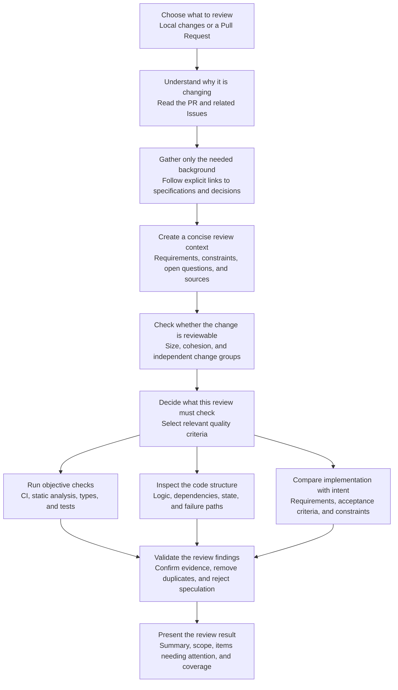

# review

English | [日本語](README.ja.md) | [简体中文](README.zh-CN.md)

A Claude Code plugin for reviewing local changes and GitHub pull requests.

This is a clean-room implementation inspired by multi-stage review workflows.
Its context collection, review planning, specialized review layers, finding
verification, and report generation are implemented entirely by this plugin.

## Documentation

- [Runtime specification (English)](REVIEW.md)
- [日本語ドキュメント](docs/ja/README.md)
- [简体中文文档](docs/zh-CN/README.md)

## Workflow



The context agent may use any compatible read-only source available in the
user's environment. It follows only references connected to the review target
and passes a compact Evidence Packet—not raw source documents—to the review
layers.

## Structure

```text
review/
├── .claude-plugin/
│   └── plugin.json
├── agents/
│   ├── context/
│   │   └── context.md
│   ├── validation/
│   │   └── small-cls.md
│   ├── review/
│   │   ├── mechanical-reviewer.md
│   │   ├── structural-reviewer.md
│   │   └── contextual-reviewer.md
│   ├── comment/
│   │   └── comment.md
├── commands/
│   └── review.md
├── REVIEW.md
├── docs/
│   ├── ja/
│   └── zh-CN/
├── README.md
├── README.ja.md
├── README.zh-CN.md
└── LICENSE
```

## Usage

```text
/review:review
/review:review 123
/review:review https://github.com/owner/repository/pull/123
```

The first command reviews local branch and working-tree changes. Supplying a PR
number or URL switches to reviewer mode.

Before review begins, the `context` agent follows only references explicitly
connected to the review target and converts the required information into a
compact, source-independent Evidence Packet. Raw Notion, Confluence, Google
Docs, GitHub, web, or repository content is not passed directly to the review
agents.

## Development

```bash
claude plugin validate . --strict
claude --plugin-dir .
```

Licensed under the MIT License.
