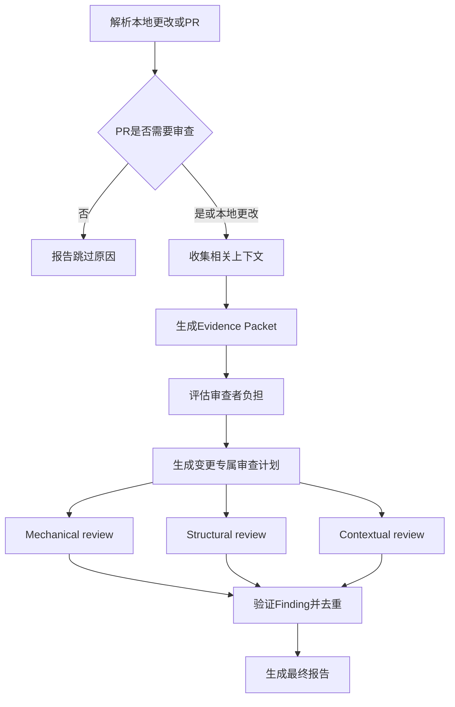

# Review Plugin

[English](README.md) | [日本語](README.ja.md) | 简体中文

使用专业代理、仓库检查和基于证据的Finding验证，自动审查本地更改和GitHub Pull Request。

## 概述

Review Plugin收集相关上下文，判断变更是否适合审查，生成针对当前变更的计划，并从mechanical、structural和contextual三个角度审查实现。独立验证阶段会在生成最终报告前排除推测性或重复的Finding。

支持两种模式：

- **Developer mode**：审查当前仓库中的提交和工作树更改。
- **Reviewer mode**：审查通过编号或URL指定的GitHub Pull Request。

本插件是参考常见多阶段审查流程完成的洁净室实现。上下文收集、计划、审查、Finding验证和报告生成均在本插件内完成。

## 命令

### `/review:review`

基于证据审查本地更改或GitHub Pull Request。

处理内容：

1. 解析本地更改或指定的Pull Request。
2. 在Reviewer mode中判断是否需要审查，并跳过closed、draft、trivial或already-reviewed的PR。
3. 仅收集与审查目标明确相关的上下文。
4. 评估变更是否给审查者造成过大负担。
5. 根据变更和`REVIEW.md`生成审查计划。
6. 并行运行三个专业审查层：
   - Mechanical review：测试、静态分析和客观信号
   - Structural review：设计、执行路径、状态、安全、性能和可维护性
   - Contextual review：需求、意图、兼容性和文档
7. 根据代码和可用证据重新验证Finding候选项。
8. 仅报告已验证的Finding、需要人工判断的事项和明确限制。

用法：

```text
/review:review
/review:review <PR编号>
```

也支持自然语言请求：

```text
审查我的本地更改
审查PR 123
审查这个PR: https://github.com/owner/repository/pull/123
```

Pull Request URL可以用于自然语言请求，但不能作为`/review:review`的直接参数。

功能：

- Developer mode和Reviewer mode
- Pull Request审查必要性验证
- 基于ISO/IEC 25010质量特性的变更专属计划
- 并行执行Mechanical、Structural和Contextual review
- 从明确引用的来源中进行只读上下文收集
- 使用精简的Evidence Packet而非原始文档
- 独立验证Finding并去重
- 明确展示审查覆盖范围、证据和限制

审查报告格式：

```text
## Review Summary

Potential problems: 1
Human decisions: 1
Verified concerns: 6
Could not verify: 1

## Change Scope

Focused — one self-contained change

## Needs Your Attention

1. Potential problem: retry can duplicate the write operation
   Evidence: src/example.ts:42
   Confirm: whether the external operation is idempotent

## Review Coverage

| Subcharacteristic | Concern | Result | Evidence |
|---|---|---|---|
| Recoverability | Recovery and consistency | Retry path inspected | src/example.ts:35 |
```

结果分类：

- **Potential problem**：变更代码、现实触发条件和可观察影响表明可能存在缺陷。
- **Human decision**：代码事实已知，但需要产品、设计或业务判断。
- **Verified by AI**：已检查适用范围，未发现该关注点的问题。
- **Could not verify**：缺少所需规格、测量结果、权限或执行证据。

过滤的误报：

- 未受本次变更实质影响的既有问题
- 没有现实执行路径的假设问题
- 已由CI覆盖的格式、lint或简单类型错误
- 个人风格偏好和含糊的一般建议
- 重复或缺乏依据的Finding

## 安装

开发时直接加载插件：

```bash
claude --plugin-dir /path/to/review
```

使用前进行验证：

```bash
claude plugin validate /path/to/review --strict
```

## 最佳实践

### 使用`/review:review`

- Pull Request说明应聚焦于意图、行为和约束。
- 明确链接相关Issue、规格和决策。
- 从干净且有效的Git仓库运行审查。
- 将Finding作为人工决策的证据，而不是自动批准或拒绝。
- 保持仓库定义的测试和静态分析命令与CI一致。

### 适用场景

- 创建Pull Request前的本地更改
- 包含有意义的行为或架构变更的Pull Request
- 涉及关键代码路径、持久化、认证或外部服务的变更
- 需要根据链接来源检查需求或兼容性的变更
- 需要独立验证行为和代码库影响的重构

### 不适用场景

- 没有可审查的提交或工作树更改
- 只有自动化已覆盖的格式变更或生成文件
- 用于替代缺失的产品需求或人工判断
- 无法通过可用的只读工具访问目标

## 工作流集成

### 标准本地审查工作流

```text
# 在本地仓库中进行更改
/review:review

# 查看Needs Your Attention和Review Coverage
# 修复已确认的问题并重新运行审查
```

### 标准Pull Request审查工作流

```text
# 使用PR编号审查
/review:review 123

# 或通过自然语言指定URL
审查这个PR: https://github.com/owner/repository/pull/123

# 确认Finding并由人工作出最终审查决定
```

审查默认是只读的。除非用户另行明确要求，否则不会修改源文件、安装依赖、修改仓库配置或发布GitHub评论。

## 要求

- 支持插件和代理的Claude Code
- Developer mode使用的Git仓库
- Reviewer mode使用的、已安装并认证的GitHub CLI（`gh`）
- 对目标仓库和Pull Request的访问权限
- 用于Mechanical verification的仓库既有测试或分析命令
- 需要外部证据时可用的兼容只读工具

## 故障排除

### 未找到更改

问题：Developer mode报告没有可审查内容。

解决方法：

- 确认当前分支存在领先于upstream的提交。
- 检查staged、unstaged或相关的untracked源文件。
- 从目标Git仓库运行命令。

### 无法解析Pull Request

问题：Reviewer mode无法加载指定的Pull Request。

解决方法：

- 确认`gh auth status`成功。
- 确认仓库配置了正确的GitHub remote。
- 检查PR编号或URL是否属于当前仓库。
- 仅提供一个无歧义的Pull Request目标。

### 审查被标记为未完成

问题：一个或多个检查无法完成。

解决方法：

- 查看`Could not verify`条目中缺失的前置条件或证据。
- 使引用的规格能够通过兼容的只读来源访问。
- 如果现有仓库检查需要依赖，请恢复这些依赖。
- 当不可信Pull Request需要执行仓库代码时，单独批准执行。

### 测试或静态分析未运行

问题：Mechanical verification将命令记录为blocked或unavailable。

解决方法：

- 记录仓库的test、lint、type-check和build命令。
- 确认所需依赖已安装；审查不会安装依赖。
- 确认命令可在当前环境中安全运行。

### Finding过多或过少

问题：审查重点与仓库需求不匹配。

解决方法：

- 使用具体的适用条件和验证标准更新`REVIEW.md`。
- 在受影响代码附近添加明确的仓库指南。
- 改进Pull Request说明并链接权威需求来源。

## 提示

- 使用范围集中的Pull Request；内聚的变更更容易可靠验证。
- 不仅说明改了什么，也要说明为何更改。
- 直接链接需求，以便只获取相关部分。
- 在仓库中保留可复现的CI命令。
- 不要猜测证据缺口，应查看`Could not verify`结果。
- 使用Review Coverage查看已完成的检查和限制。

## 配置

### 自定义审查标准

编辑`REVIEW.md`可更改质量关注点、适用条件、验证指南、结果分类或最终报告策略。

默认覆盖模型考虑以下ISO/IEC 25010质量特性：

- 功能适合性
- 可靠性
- 性能效率
- 易用性
- 安全性
- 兼容性
- 可维护性
- 可移植性

仅选择适用于当前变更的标准。

### 自定义代理

代理职责和输出约定定义在`agents/`目录中：

- `agents/context/context.md` — 上下文收集和Evidence Packet生成
- `agents/validation/review-needed.md` — Pull Request审查必要性
- `agents/validation/small-cls.md` — Change Scope和审查者负担
- `agents/review/mechanical.md` — 客观仓库检查
- `agents/review/structural.md` — 代码和架构分析
- `agents/review/contextual.md` — 意图和需求分析
- `agents/comment/comment.md` — Finding验证和去重

编排和最终报告规则保存在`skills/review/SKILL.md`中。

## 技术细节

### 目录结构

```text
review/
├── .claude-plugin/
│   └── plugin.json
├── agents/
│   ├── context/
│   │   └── context.md
│   ├── validation/
│   │   ├── review-needed.md
│   │   └── small-cls.md
│   ├── review/
│   │   ├── mechanical.md
│   │   ├── structural.md
│   │   └── contextual.md
│   ├── comment/
│   │   └── comment.md
│   └── README.md
├── skills/
│   └── review/
│       └── SKILL.md
├── docs/
│   ├── ja/
│   └── zh-CN/
├── REVIEW.md
├── README.md
├── README.ja.md
├── README.zh-CN.md
└── LICENSE
```

### 代理架构

- 1个eligibility agent判断Pull Request是否需要审查。
- 1个context agent收集明确引用的证据。
- 1个scope agent对内聚性和审查者负担进行分类。
- review skill生成针对目标的审查计划。
- 3个专业代理并行审查Mechanical、Structural和Contextual关注点。
- 1个comment agent验证候选Finding并生成已验证结果集。
- review skill在不新增或重新评估Finding的情况下格式化最终报告。

### 审查工作流



### 上下文处理

context agent只跟随与审查目标相关联的引用。后续阶段接收精简的Evidence Packet，而不是Notion、Confluence、Google Docs、GitHub、Web或仓库文档的原始内容。缺失信息和来源冲突会明确保留在Packet和最终覆盖报告中。

### GitHub集成

Reviewer mode使用`gh`完成：

- 解析Pull Request元数据、分支和SHA
- 读取变更文件、diff、关联Issue和检查状态
- 在不修改工作树的情况下访问仓库信息

如果需要checkout，工作流会从解析出的head SHA创建隔离的临时worktree，并在证据收集后删除。

## Author

takuto-san

## Version

0.1.0

基于[MIT License](LICENSE)授权。
