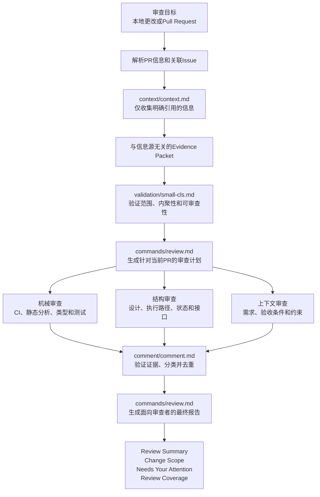

# review

[English](README.md) | [日本語](README.ja.md) | 简体中文

一个用于审查本地更改和GitHub Pull Request的Claude Code插件。

本插件是参考常见多阶段审查流程完成的洁净室实现。上下文收集、审查计划、专业化审查层、Finding验证以及最终报告生成均在本插件内完成。

## 文档

- [简体中文文档](docs/zh-CN/README.md)
- [运行时英文审查标准](REVIEW.md)
- [日本語ドキュメント](docs/ja/README.md)

## 工作流程



`context`代理可以使用用户环境中任何兼容的只读信息源。它只跟踪与审查目标明确关联的引用，并向审查层传递精简的Evidence Packet，而不是原始文档。

## 目录结构

```text
review/
├── .claude-plugin/
│   └── plugin.json
├── agents/
│   ├── context/
│   │   └── context.md
│   ├── validation/
│   │   └── small-cls.md
│   ├── review/
│   │   ├── mechanical-reviewer.md
│   │   ├── structural-reviewer.md
│   │   └── contextual-reviewer.md
│   ├── comment/
│   │   └── comment.md
├── commands/
│   └── review.md
├── REVIEW.md
├── docs/
│   ├── ja/
│   └── zh-CN/
├── README.md
├── README.ja.md
├── README.zh-CN.md
└── LICENSE
```

## 使用方法

```text
/review:review
/review:review 123
/review:review https://github.com/owner/repository/pull/123
```

第一个命令审查当前分支和工作树中的本地更改。提供PR编号或URL后，将切换到审查者模式。

审查开始前，`context`代理只获取审查目标明确引用的信息，并将其转换为精简且与信息源无关的Evidence Packet。Notion、Confluence、Google Docs、GitHub、Web或仓库文档中的原始内容不会被直接传递给审查代理。

## 开发

```bash
claude plugin validate . --strict
claude --plugin-dir .
```

本项目采用MIT许可证。
